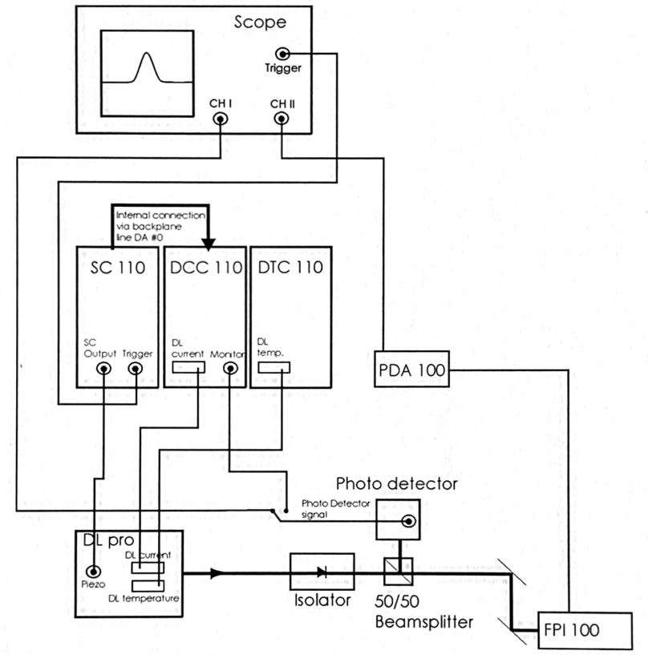

The handbook is a user manual of diode laser DL pro[@diode_manual]. 

![Laser setup by manufacturer under the protective cover [@diode_manual]. Product ID No.: DLpro_11236](pictures/laser-setup-by-manufacturer.png){#fig-laser-setup width=80%}

**Tasks:**

- getting an understanding of the input– and output parameters


::: {.callout-note collapse="true"}
## Preliminary notes 

**1 Grating Stabilized Diode Laser Head DL pro**

- Littrow-Hänsch-type grating stabilized ECDL
  - explaining that the first diffraction order $m=1$ is reflected back at the laser diode (1.1)

**2 Safety instructions and Warnings**

- laser source up to class 3b
- "Any plug in module should only be opened by trained personnel. Before exchanging and
opening any module, the Diode LaserSystem DL pro must be switched off and disconnected
from the mains supply."
- if doing anything out of the ordinary with the internal Laser setup switch off Scan control and disconnect piezo supply
- adjustments should be made by trained personal
- "When making adjustments be sure to wear a high-impedance grounding strip around the wrist at all times."
- avoid high and uncontrolled optical feedback, this may damage/destroy the laser diode
- turn off laser diode before connecting cables and verify the according parameters, to prevent damaging laser diode
- the cover should not be removed under operation, due to stray light
- the laser diode is extremely sensitive to electrostatic discharge

**2.2 Laser beam**

- emits up to $<500\text{mW}$ power

**4.3 Power Up and Check of the Production and Quality Control Data Sheet:**

- instructions for turning the laser diode on

**4.5 ContinuoUs Operation of the Diode Laser Head DL pro:**

- how to obtain a continuos and stable signal 
:::

::: {.callout-note collapse="true"}
## Tuning of the Diode Laser
**4.6 Tuning the Diode Laser Head DL pro:** 

- describes how to find frequencies 
- question on single or multi mode operation
- mode hop free tuning of laser diode

**4.6.1 Manual Coarse Tuning of the Wavelength**

- by tuning the grating angle by a fine threaded screw (2 in @fig-laser-setup) the wavelength may be varied up to $100\text{nm}$ (no realignement of optical set up required)   

$$\sin(\alpha_g)=\frac{m\lambda}{2d}$$

- half a turn on fine threaded screw -> $\sim 6\text{nm}$
- maximum laser current $I_{max}(\lambda)$ is dependant on the parameter of the wavelength $\lambda$

**4.6.2 Single Mode and Coherence Control**
factors that affect the ECDL mode frequency/wavelength

1) medium gain profile (of diode gain medium)
2) internal cavity i.e. diode length $l$
3) external resonator mode defined by $L$ (optical distance of rear internal cavity mirror to the grating) 
3) grating profile

![Here the effects of the various components and physical parameters have on the line width [@diode_manual]. The ](pictures/factors-determining-single-mode-laser-frequency.png){#fig-laser-setup width=80%}

- with varying laser diode current $I_{D}$ the profiles 2) & 3) move with different speeds!
- refraction index $n$ depends on internal intensity of the resonator
- temperature $T$ changes 1) - 4) "asynchronously"
- if running in a single mode, the Fabry-Pérot interferometer shows fringes equidistantly

**4.6.3 Mode-Hop Free Tuning of the wavelength**

- tuning the piezo actuator changes the length $L$ of the external cavity as well as the grating angle $\alpha_g$ thus changing the grating profile 
- one should scan, i.e. change $I_D$ by applying a ramp proportional to Sc 110 output ramp  

::: {layout="[60,40]"}

:::

:::

